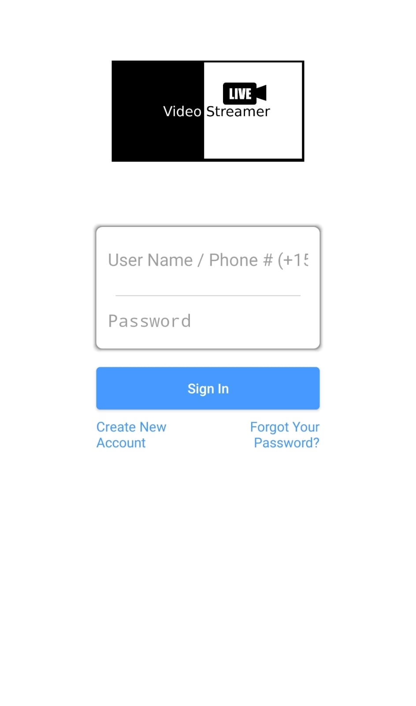
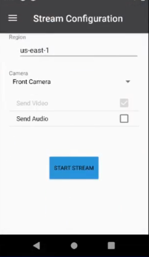
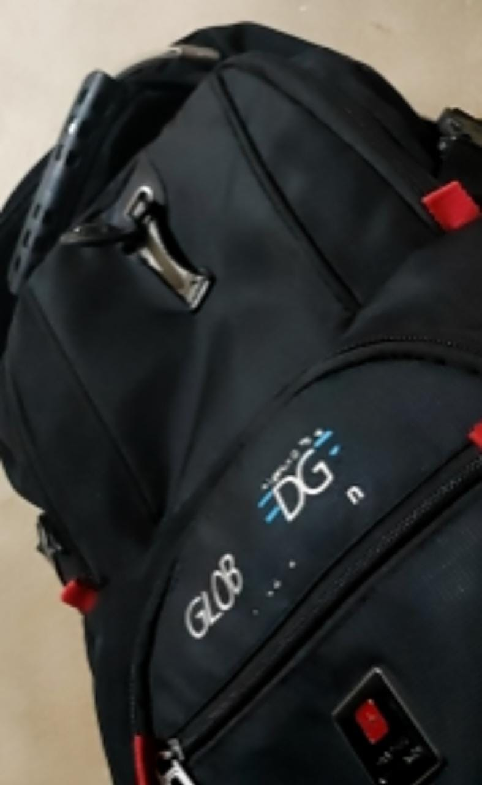
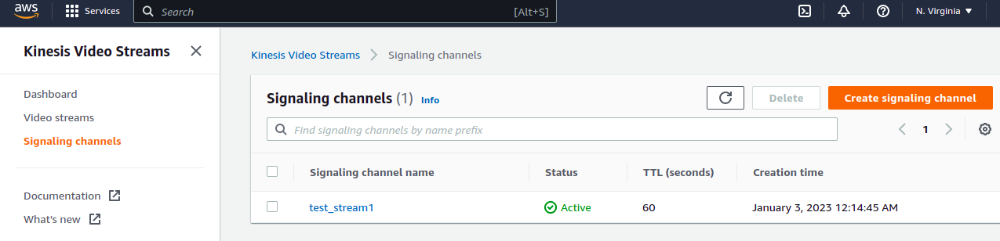
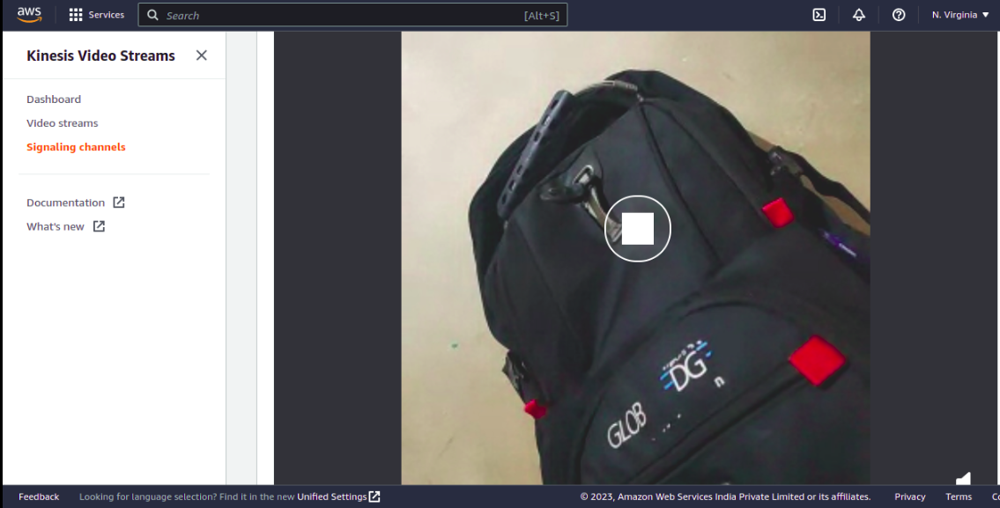

# Enable Video Streaming on CM2290 using AWS Kinesis Webrtc
The goal of this project is to build and deploy a live video camera streaming to AWS Kinesis video streaming service.  Implemented Android Application for Thundercomm TurboX CM2290 LA (Linux Android) DK (Development Kit), Application source can helps to developer to build & deploy AI Camera Applications on the edge devices & Stream the same on Video Streaming Services.

## Prerequisites:
- Download the Android Studio based on host system. Refer the link provided (https://developer.android.com/studio?gclid=EAIaIQobChMI8qLmyajE-wIVmX4rCh1npgMDEAAYASAAEgLQAPD_BwE&gclsrc=aw.ds).
- Download and Install the Application Tool chain SDK. (Setup instructions can be found in Application SDK User Manual).
  https://www.thundercomm.com/product/cm2290-c2290-development-kit/
- Download AWS webRTc SDK for android  / or we can  add dependencies in build.gradle which shows in below steps.


## 1. Steps to create android application
- 1.1 Clone the project on development host
  Clone the project

- 1.2 Open project in android studio
    1. Open android studio
    2. Click on File
    3. open-> select folder_to _open->
    4. OK-> open in New_window
       Note : Wait till Gradle sync finishes successfully

- 1.3 We need a following dependencies in Gradle file add following lines in  build.gradle(project) file inside dependencies  section:
```
   - implementation ("com.amazonaws:aws-android-sdk-kinesisvideo:$aws_version@aar") { transitive = true } 
    - implementation ("com.amazonaws:aws-android-sdk-kinesisvideo-signaling:$aws_version@jar") { transitive = true } 
    - implementation ("com.amazonaws:aws-android-sdk-mobile-client:$aws_version@aar") { transitive = true } 
    - implementation ("com.amazonaws:aws-android-sdk-auth-userpools:$aws_version@aar") { transitive = true } 
    - implementation ("com.amazonaws:aws-android-sdk-auth-userpools:$aws_version@aar") { transitive = true } 
```

# 2  AndroidMainfest.xml:
Make sure that manifest file has the appropriate declarations to allow use of camera hardware and other related features.
- Internet Permission
  Application must require permission of internet to stream video.

         <uses-permission android:name="android.permission.INTERNET"/>   


- Camera Permission  
  Your application must request permission to use a device camera.

        <uses-permission android:name="android.permission.CAMERA" /> 

- Camera Features  
  Your application must also declare use of camera features, for example:

        <uses-feature android:name="android.hardware.camera" /> 


- Audio Recording Permission  
  For recording audio with video capture, your application must request the audio capture permission

        <uses-permission android:name="android.permission.RECORD_AUDIO" /> 


## 3. Steps to build the WebRTC SDK in android
Import the Android WebRTC SDK into the Android Studio integrated development environment (IDE)
1. To import WebRTC SDK Add the dependencies in gradel.build             (project)file inside dependencies section:
   ``` implementation 'org.webrtc:google-webrtc:1.0.32006'   ```
2. After adding dependencies in gradel.build it automatically start syncs the file.

3. If not - initiate a sync. If you see a build error.

4. There will be pop up message to Choose and install required SDKs by choosing Install missing SDK package(s), then click Accept and complete the install.

## 4.Configure Amazon Cognito (user pool and identity pool) setting :

* Go to https://console.aws.amazon.com/cognito/
* Click `Manage User Pools`
* Click `Create a user pool`
* Fill-in `Pool name`
* Click `Review defaults`
* Click `Create user pool`
* Copy `Pool Id`
* Select `App clients` in the left navigation.
* Click `Add an app client`
* Fill-in `App client name`
* Click `Create app client`
* Click `Show details` and copy `App client id` and `App client secret`

### 4.1. Create an identity pool
* Open the Amazon Cognito console.
* Choose Manage Identity Pools.
* Choose Create new identity pool.
* Type a value for Identity pool name, for example, <username>_android_identity_pool.
* Expand the Authentication providers section. On the Cognito tab, add the values for the User Pool ID and App client ID from the previous procedure.
* Choose Create pool.
* On the next page, expand the Show Details section.
* In the section that has a value for Role name that ends in Auth Role (if you do not have a role, you must create one), choose View Policy Document.
* Choose Edit, confirm the Edit Policy dialog box that appears, and then paste the following JSON into the editor
* Choose Allow.
* On the next page, copy and save the Identity pool ID value from the Get AWS Credentials code snippet. You need this value to configure the awsconfiguration.json file in the Android WebRTC SDK.

## 4.2 AwsConfiguration.json:
1.  You will need all the information from the above steps copied in clipboard, then replace with "REPLACE WITH YOUR VALUE" with ur value in  awsconfiguration.json file  which  look something like this:
 ```json
 {
  "Version": "1.0",
  "CredentialsProvider": {
    "CognitoIdentity": {
      "Default": {
        "PoolId": "REPLACE WITH YOUR VALUE",
        "Region": "REPLACE WITH YOUR VALUE"
      }
    }
  },
  "IdentityManager": {
    "Default": {}
  },
  "CognitoUserPool": {
    "Default": {
      "AppClientSecret": "REPLACE WITH YOUR VALUE",
      "AppClientId": "REPLACE WITH YOUR VALUE",
      "PoolId": "REPLACE WITH YOUR VALUE",
      "Region": "REPLACE WITH YOUR VALUE"
    }
  }
}
 ```

## 5. Steps to build and run application using ADB:
- Connect the target device to host machine using C to USB cable
- Once Device is connected allow the usb debugging in target device:

                    1.Go to setting  
                    2.Click to developer mode option 
                    3.search for USB debugging option and ON it 

-  Once USB debugging is ON your target device is get connect to host machine and available in android studio devices list.
-  Now you can directly run app on target device.

## 5. Run the Android App on CM2290 :
- Before running the application, set the execution environment by following below steps:
    1. Connect kit to the host system, enter following adb commands

            $ adb disable-verity 
            $ adb reboot 
            $ adb root 
            $ adb remount  	 
    2. Turn on  Wi-Fi in android kit. Select the available Wi-Fi by entering password
    3.  Set the latest UTC time and date in setting->Date and time setting.

- Steps for running the main application are as follows:
    1. Go to android studio and generate APK file for k-streamer-app project. Refer below steps:
        1. Once the build successful, go to Build menu and select Build  
           Bundle(s)/APK(s)  from the dropdown then select Build APK(s).
        2. Above step will download APK file in the following  directory.
           K-streamer-app/app/build/outputs/apk/debug/KVStreamerWeb.apk
        3. Open the application on kit and sign up with Create New Account or sign in with existing accounts. (Note: This account information is stored in your Cognito User Pool and is not your AWS Console user  name/password.)
           
        4. Once login is successful, you will entering the following channel information
           
           

        5. Enter a channel name: e.g. test_stream1
        6. Enter AWS region: e.g. us-west-2
        7. Select audio if you would like to send both audio also.
        8. To see the final results / live video open the AWS kinesis inside  -> signaling channel section -> select the channel name which had given above -> open Media playback viewer (live video streaming output will show here).

## Live Streaming result  on AWS kinesis  as shown below.
- Same stream is created at AWS kinesis:
  
- Live video streaming from cm2290 camera output on AWS kinesis:
  
- 

Source code is referred from AWS Kinesis Video Stream Sample (https://github.com/awslabs/amazon-kinesis-video-streams-webrtc-sdk-android)

